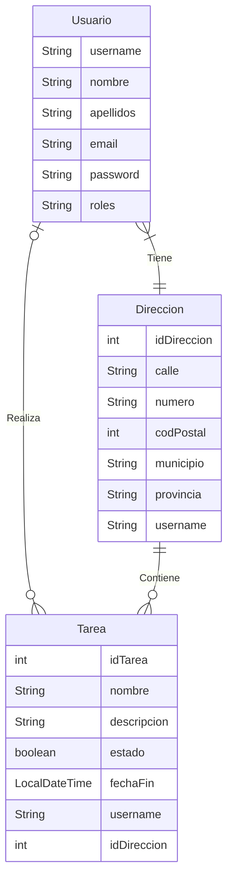

# 🍃☕ PROYECTO SPRING BOOT ☕🍃

## 💡 IDEA DE LA APLICACIÓN 💡
**Aplicación que servirá para administrar las tareas del hogar.**
Se darán de alta tareas con una fecha y descripción, usuarios a los cuales se les asignarán las tareas y direcciones las cuales pertenecerán a los usuarios.

### 🔧 FUNCIONALIDADES 🔧
- **Registrar** tareas, usuarios y direcciones.
- **Listar** tareas, usuarios y direcciones.
- **Actualizar** tareas, usuarios y direcciones.
- **Eliminar** tareas, usuarios y direcciones.
- Asignar tareas a usuarios y direcciones.
- Asignar direcciones a usuarios.

Tablas de la base de datos: **Usuarios**, **Direcciones** y **Tareas**.

---
---

## 💾 TABLAS DE LA BASE DE DATOS 💾
### 👨 Usuarios 👨
|      CAMPO      |     TIPO      |   RESTRICCIONES                                               |
|   :---------:   |  :-------:    | :---------------:                                             |
|   `username`    |   VARCHAR     |  `PRIMARY KEY`, longitud: 5-20                                |
|   `nombre`      |   VARCHAR     |  `NOT NULL`                                                   |
|   `apellidos`   |   VARCHAR     |  -                                                            |
|   `email`       |   VARCHAR     |  `NOT NULL`, `UNIQUE`, debe contener @ y terminar en .com/.es |
|   `password`    |   VARCHAR     |  `NOT NULL`, longitud: 5-20                                               |
|   `roles`       |   VARCHAR     |  Valores: `ADMIN` / `USER`                                    |

### 🏠 Direcciones 🏠
|      CAMPO      |     TIPO      |   RESTRICCIONES                                  |
|   :---------:   |  :-------:    | :---------------:                                |
|   `idDireccion` |   NUMBER      | `PRIMARY KEY`, Autoincremento                    |
|   `calle`       |   VARCHAR     | `NOT NULL`                                       |
|   `numero`      |   VARCHAR     | `NOT NULL`, debe ser mayor que 0                 |
|   `codPostal`   |   NUMBER      | `NOT NULL`, exactamente 5 dígitos                |
|   `municipio`   |   VARCHAR     | `NOT NULL`                                       |
|   `provincia`   |   VARCHAR     | `NOT NULL`, debe ser una provincia de Andalucía  |
|   `username`    |   VARCHAR     | `FOREIGN KEY`                                    |

### 📃 Tareas 📃
|      CAMPO      |     TIPO      |   RESTRICCIONES                         |
|   :---------:   |  :-------:    | :---------------:                       |
|   `idTarea`     |   NUMBER      | `PRIMARY KEY`, Autoincremento           |
|   `nombre`      |   VARCHAR     | `NOT NULL`                              |
|   `descripcion` |   TEXT        | -                                       |
|   `estado`      |   BOOLEAN     | Por defecto `false`                     |
|   `fechaFin`    |   DATETIME    | No puede ser anterior a la fecha actual |
|   `username`    |   VARCHAR     | `FOREIGN KEY`                           |
|   `idDireccion` |   NUMBER      | `FOREIGN KEY`                           |

---
---

## 📑 DIAGRAMA ENTIDAD-RELACIÓN 📑
+ **Usuario (1:N) <- Tiene (1:N) ->  Direccion (1:1)**
+ **Usuario (0:1) <- Realiza (1:N) -> Tarea (0:N)**
+ **Direccion (1:1) <- Contiene (1:N) -> Tarea (0:N)**

---
---

## 🔗 ENDPOINTS 🔗
### 👨 UsuarioController 👨
|      MÉTODO     |      ENDPOINT            |   DESCRIPCIÓN                     |  ACCESO   |
|   :---------:   |   :------------:         | :---------------:                 |:---------:|
|   POST          |   `/usuario`             |  Inicio de sesión                 | Público   |
|   POST          |   `/usuarios`            |  Registrar usuarios               | Público   |
|   GET           |   `/usuarios`            |  Listar usuarios                  | ADMIN     |
|   PUT           |   `/usuarios`            |  Actualizar usuario (propio)      | USER      |
|   PUT           |   `/usuarios/{username}` |  Actualizar usuarios (todos)      | ADMIN     |
|   DELETE        |   `/usuarios`            |  Eliminar usuario (propio)        | USER      |
|   DELETE        |   `/usuarios/{username}` |  Eliminar usuarios (todos)        | ADMIN     |

### 🏠 DireccionController 🏠
|      MÉTODO     |      ENDPOINT               |   DESCRIPCIÓN                      |  ACCESO   |
|   :---------:   |   :------------:            | :---------------:                  |:---------:|
|   POST          |   `/direcciones`            |  Registrar direcciones             | USER      |
|   GET           |   `/direcciones`            |  Listar direcciones (propias)      | USER      |
|   GET           |   `/direcciones/{username}` |  Listar direcciones (todas)        | ADMIN     |
|   PUT           |   `/direcciones/{id}`       |  Actualizar direcciones            | USER      |
|   DELETE        |   `/direcciones/{id}`       |  Eliminar direcciones (propias)    | USER      |
|   DELETE        |   `/direcciones/{username}` |  Eliminar direcciones (todas)      | ADMIN     |

### 📃 TareaController 📃
|      MÉTODO     |      ENDPOINT          |   DESCRIPCIÓN                      |  ACCESO   |
|   :---------:   |   :------------:       | :---------------:                  |:---------:|
|   POST          |   `/tareas`            |  Registrar tareas                  | USER      |
|   GET           |   `/tareas`            |  Listar tareas (propias)           | USER      |
|   GET           |   `/tareas/{username}` |  Listar tareas (todas)             | ADMIN     |
|   PUT           |   `/tareas/{id}`       |  Actualizar tareas                 | USER      |
|   DELETE        |   `/tareas/{id}`       |  Eliminar tareas (propias)         | USER      |
|   DELETE        |   `/tareas/{username}` |  Eliminar tareas (todas)           | ADMIN     |

---
---

## 🧠 LÓGICA DE NEGOCIO 🧠

⚠️ Cualquier acción con excepción de **Registrar usuarios** e **Inicio de sesión** requiere un usuario. ⚠️

### 👨 Usuarios 👨
- `username` es la **clave primaria** de la **tabla Usuarios**.
- `username` debe tener una **longitud: 5-20** caracteres.
- `nombre` **no puede ser nulo**.
- `email` **no puede ser nulo** y tiene que ser **único**, además, debe contener **@** y terminar en **.com/es**.
- `password` **no puede ser nulo**, debe tener una **longitud: 5-20** caracteres que solo pueden ser **alfanuméricos**, y quedará hasheada en la base de datos.
- Hay dos tipos de roles: `USER` o `ADMIN`.
- Cualquiera puede **registrarse** e **iniciar sesión**.
- Un `USER` puede **actualizar** y **eliminar** sus datos.
- Un `ADMIN` puede **listar**, **modificar** y **eliminar** todos los **usuarios**.
- Si un **usuario** es **eliminado**, también se eliminan su **dirección** y **tareas** asociadas (relación fuerte).
- Hay un campo llamado `repetirPassword` que solo se usa en el registro para verificar `password`, y debe coincidir exactamente con él.

### 🏠 Direcciones 🏠
- `idDireccion` es la **Clave Primaria** de la **tabla Direcciones** y la **Clave Foránea** de la **tabla Tareas**, además, tiene autoincremento.
- `numero` debe ser **mayor que 0**.
- `codPostal` debe tener exactemente **5 dígitos**.
- `provincia` debe ser una de **Andalucía**.
- `username` es la **clave foránea** de la **tabla Direcciones**.
- Todos los campos son **obligatorios**.
- Cada dirección está asociada a **un único usuario**.
- Un `USER` puede **registrar**, **listar**, **actualizar** y **eliminar** sus direcciones.
- Un `ADMIN` puede **listar** y **eliminar** todas las **direcciones**.

### 📃 Tareas 📃
- `idTarea` es la **Clave Primaria** de la **tabla Tareas** y tiene autoincremento.
- `nombre` **no puede ser nulo**.
- `estado` por defecto es `false`.
- `fechaFin` **no puede ser anterior a la fecha actual**.
- `username` e `idDireccion` son las **claves foráneas** de la **tabla Tareas**.
- Una **tarea** solo puede asignarse a **un usuario** y **una dirección**.

---
---
